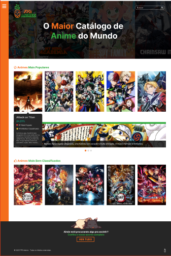
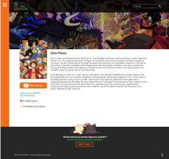
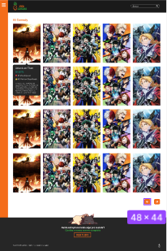
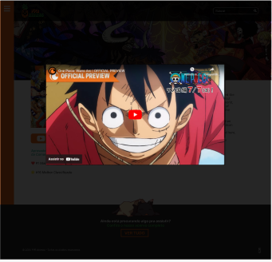

# PROJETO FPR-ANIME

# SOBRE O PROJETO

O projeto FPR-ANIME é um projeto Front-End desenvolvido em NEXT.js.
O projeto foi um desafio proposto com proposito para testar minhas habilidades de desenvolvimento de uma interface funcional.

Crie uma aplicação de Animes utilizando a API do Kitsu, a Aplicação terá que seguir o modelo do Figma enviado.
Espera-se do candidato uma aplicação do qual deve conter no mínimo:
Home, com menu com as categorias, com carrossel funcionando, e link de ver tudo mandando para pagina de animes.

<li>Página de ver todos os animes paginada</li>
<li>Página de resultado da busca</li>
<li>Página interna de cada anime com trailer</li>
<li>Página de animes por categoria</li>

# Tecnologias utilizadas

<li>NextJS</li>
<li>ReactJS</li>
<li>Material-UI</li>
<li>Axios</li>
<li>Styled-Components</li>

# Como executar o projeto

### pré-requisitos: Node 16.16 ou superior

```bash
#clonar repositório
https://github.com/Yan-Jardim/AnimeFPR

#entrar na pasta do projeto
cd FPR-Anime

#executar o projeto
1 - npm install
2 - npm run dev
```

## Fotos do Projeto

<div align="center">
  <p>Home</p>

</div>
<br/>

<div align="center">
  <p>Drawer</p>

</div>
<br/>

<div align="center">
  <p>Page Anime</p>

</div>
<br/>

<div align="center">
  <p>Page Categorias</p>

</div>
<br/>

<div align="center">
  <p>Modal</p>

</div>
 <br/>

# autor

### Yan Jardim e Silva
